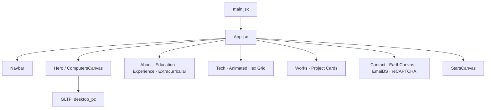

# Hamza Ahmed Portfolio

Simple setup instructions for running this project locally.

## Requirements

- Node.js 18 or later
- npm

## Install

```bash
npm install
```

## Run in development

```bash
npm run dev
```

## Build for production

```bash
npm run build
```

## Preview production build

```bash
npm run preview
```

## Environment variables

Create a `.env.local` file in the root folder:

```dotenv
VITE_EMAILJS_SERVICE_ID=your_emailjs_service_id
VITE_EMAILJS_TEMPLATE_ID=your_emailjs_template_id
VITE_EMAIL_JS_ACCESS_TOKEN=your_emailjs_public_key_or_token
VITE_RECAPTCHA_SITE_KEY=your_recaptcha_site_key
```

## Useful scripts

- `npm run dev` - start local server
- `npm run build` - create production build in `dist/`
- `npm run preview` - preview production build
- `npm run lint` - run linter

## Contact

- Email: `Hamzalek@gmail.com`
- LinkedIn: `https://www.linkedin.com/in/hamza-ahmed-224173198/`
<div align="center">

# Hamza Ahmed — 3D Portfolio

<p align="center">
	<a href="https://github.com/hamzaahmed4064-arch/portfolio/stargazers"></a>
	<a href="https://github.com/hamzaahmed4064-arch/portfolio/network/members"></a>
	<a href="#tech-stack"></a>
	<a href="LICENSE"></a>
	<a href="#"></a>
</p>

<p align="center">
	<a href="https://github.com/hamzaahmed4064-arch/portfolio/issues"></a>
	<a href="https://github.com/hamzaahmed4064-arch/portfolio/pulls"></a>
	
	
	
	<a href="#contributing"></a>
</p>

</div>

<p align="center">
	<picture>
		<!--  -->
	</picture>
</p>

An immersive, performant portfolio powered by React, react-three-fiber (Three.js), and Tailwind CSS — featuring a 3D hero scene, animated skills grid, project gallery with tilt effects, and a production-ready contact form (EmailJS + reCAPTCHA) with a real-time Earth canvas backdrop.

<p align="center"><strong>Live demo available on request</strong></p>

<details>
	<summary><b>Table of Contents</b></summary>

- Overview
- Features
- Tech Stack
- Architecture
- Quick Start
- Environment Variables
- Scripts
- Project Structure
- Deployment
- SEO
- Attributions
- Roadmap
- Contributing
- Security
- FAQ
- Maintainer
- License
- Contact

</details>

## Overview


This project is a modern single-page application scaffolded with Vite and styled with Tailwind CSS, using react-three-fiber and drei to render high-fidelity 3D scenes. Animations are orchestrated with Framer Motion, and analytics are integrated via `@vercel/analytics`.

The site can be deployed to Vercel, GitHub Pages, or any static host.

## Features

- 3D Hero: Interactive desktop PC GLTF model with OrbitControls (desktop), mobile-friendly auto-rotation, and tuned camera presets.
- Starfield Background: GPU-friendly particle starfield using `maath` and R3F points.
- Animated Skills Grid: Hex-styled, animated categories (Programming, Cloud & DevOps) with responsive row logic.
- Projects Gallery: Tilted project cards with confidentiality-safe placeholders and technology tags.
- Contact Section: EmailJS-powered form with Google reCAPTCHA, confetti success state, and Earth GLTF canvas backdrop.
- Smooth UX: Framer Motion transitions, lazy loading via React.Suspense, and drei `Preload` for 3D assets.
- Responsive + Accessible: Tailwind JIT, mobile-aware camera behaviour, and color contrast mindful palette.
- Analytics + SEO: `@vercel/analytics`, `sitemap.xml`, Open Graph tags, and custom meta in `index.html`.

## Tech Stack

- Runtime: React 18, React Router 6
- 3D/Graphics: `@react-three/fiber`, `@react-three/drei`, `three`, `maath`
- Styling: Tailwind CSS
- Motion: Framer Motion
- Forms: EmailJS (`@emailjs/browser`), `react-google-recaptcha`, `react-hot-toast`, `react-confetti`
- Tooling: Vite, ESLint
- Analytics: `@vercel/analytics`

## Architecture



## Quick Start

Prerequisites
- Node.js 18+ (tested with Node 22.x per `package.json` engines)

Install and run

```powershell
npm install
npm run dev
```

Build and preview

```powershell
npm run build
npm run preview
```

## Environment Variables

The contact form and CAPTCHA require the following variables. Create a `.env.local` (or `.env`) in the project root:

```dotenv
VITE_EMAILJS_SERVICE_ID=your_emailjs_service_id
VITE_EMAILJS_TEMPLATE_ID=your_emailjs_template_id
VITE_EMAIL_JS_ACCESS_TOKEN=your_emailjs_public_key_or_token
VITE_RECAPTCHA_SITE_KEY=your_recaptcha_site_key
```

Used in `src/components/Contact.jsx` via `import.meta.env`.

## Scripts

| Script | Action |
|---|---|
| `npm run dev` | Start Vite dev server |
| `npm run build` | Build production assets to `dist/` |
| `npm run preview` | Preview the built site locally |
| `npm run lint` | Lint `src/` with ESLint |

## Project Structure

```
react-threejs-portfolio/
├─ index.html                   # Meta tags, root, Vite entry
├─ package.json                 # Scripts and dependencies
├─ public/
│  ├─ desktop_pc/              # GLTF + CC-BY license
│  └─ planet/                  # GLTF + CC-BY license
├─ src/
│  ├─ App.jsx                  # Route shell and section composition
│  ├─ components/              # UI sections and canvases
│  │  ├─ canvas/               # R3F scenes: Computers, Earth, Stars
│  │  └─ *.jsx
│  ├─ constants/               # Data for nav, projects, experiences
│  ├─ utils/motion.js          # Framer Motion helpers
│  ├─ assets/                  # Images, logos, PDFs
│  ├─ styles.js                # Shared Tailwind class tokens
│  └─ main.jsx                 # App bootstrap + analytics
└─ tailwind.config.js          # Theme, colors, hero bg
```

## Deployment

GitHub Pages (current)
- Build with `npm run build` and publish `dist/` to Pages (e.g., via Actions or manual).

Vercel (optional)
- Import repo in Vercel; framework: Vite.
- Build command: `npm run build`, output: `dist`.
- For SPA routing with React Router, Vercel will serve `index.html` for unknown routes by default. Verify deep links.

Any Static Host
- Serve the `dist/` directory over any CDN or static hosting provider.

## SEO

- `sitemap.xml` in root for crawlers.
- Open Graph meta in `index.html` including image and description.
- Descriptive keywords and title tags set.

## Attributions

3D Models (CC-BY-4.0)
- Gaming Desktop PC by Yolala1232 — https://sketchfab.com/3d-models/gaming-desktop-pc-d1d8282c9916438091f11aeb28787b66
	Credit: “This work is based on 'Gaming Desktop PC' by Yolala1232 licensed under CC-BY-4.0.” See `public/desktop_pc/license.txt`.
- Stylized planet by cmzw — https://sketchfab.com/3d-models/stylized-planet-789725db86f547fc9163b00f302c3e70
	Credit: “This work is based on 'Stylized planet' by cmzw licensed under CC-BY-4.0.” See `public/planet/license.txt`.

Libraries
- React, Three.js, react-three-fiber, drei, Tailwind CSS, Framer Motion, EmailJS, Vite, maath.

## Roadmap

- Add automated CI for lint/build and Pages deploy.
- Add light/dark theme toggle with persisted preference.
- Add screenshot/GIF previews and Lighthouse performance docs.
- Optional: switch to file-based routing and MDX-powered content.

## Contributing

Contributions, issues and feature requests are welcome!

1) Fork the repo  2) Create a feature branch  3) Commit with clear messages  4) Open a PR

Suggested commit style: conventional commits (e.g., `feat: add mobile camera preset`).

## Security

- Do not commit secrets. Use `.env.local` for EmailJS and reCAPTCHA keys.
- Report vulnerabilities privately via email: `Hamzalek@gmail.com`.

## FAQ

- Dev server won't start?
	- Ensure Node 18+ (repo targets Node 22.x). On Windows, consider `nvm-windows` to manage versions.
- Models not loading?
	- Confirm GLTF paths in `components/canvas` match files in `public/`.
- Contact form fails?
	- Verify EmailJS IDs and reCAPTCHA site key in `.env.local`.

## Maintainer

<table>
	<tr>
		<td width="80">
			
		</td>
		<td>
			<b>Hamza Ahmed</b><br/>
			<a href="mailto:Hamzalek@gmail.com">Email</a> • <a href="https://www.linkedin.com/in/hamza-ahmed-224173198/">LinkedIn</a>
		</td>
	</tr>
	<tr>
		<td colspan="2">
			⭐ If you like this project, consider starring it to support ongoing work.
		</td>
	</tr>
  
</table>

## License

This project is open source. See `LICENSE` for terms. Third-party 3D assets are licensed under CC-BY-4.0 as noted above.

## Contact

- Email: Hamzalek@gmail.com
- LinkedIn: https://www.linkedin.com/in/hamza-ahmed-224173198/

